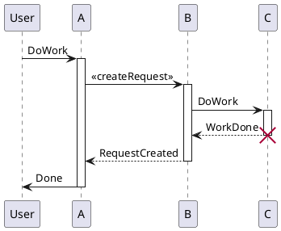
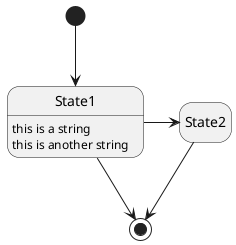

# UML Diagrams

- https://codebase.helmholtz.cloud/examples/diagrams-in-gitlab/-/tree/master/examples?ref_type=heads
- https://codebase.helmholtz.cloud/examples/diagrams-in-gitlab/-/blob/master/examples/json.md?ref_type=heads


The Unified Modeling Language (UML) is a general-purpose modeling language in
the field of software engineering.
It aims to provide a standard way to visualize the design of a system.

## Sequence Diagram
A sequence diagram shows object interactions arranged in time sequence.
It depicts objects involved in the scenario and the sequence of messages
exchanged between the objects.
Sometimes they are also called _event diagrams_ or _event scenarios_.
PlantUML syntax for sequence diagram is desribed in detail in their
[documentation](https://plantuml.com/sequence-diagram).
<details>
  <summary>Show code</summary>
  <div>

    ```plantuml
    @startuml
    participant User

    User -> A: DoWork
    activate A

    A -> B: << createRequest >>
    activate B

    B -> C: DoWork
    activate C
    C --> B: WorkDone
    destroy C

    B --> A: RequestCreated
    deactivate B

    A -> User: Done
    deactivate A
    @enduml
    ```

  </div>
</details>



## State Diagram
A state diagram is typically used in computer science to describe the behavior
of systems.
A state diagram requires that the system is composed of a finite number of
states.
PlantUML can be used to create state diagrams.
All details are available in the [documentation](https://plantuml.com/state-diagram).
<details>
  <summary>Show code</summary>
  <div>

    ```plantuml
    @startuml
    hide empty description
    [*] --> State1
    State1 --> [*]
    State1 : this is a string
    State1 : this is another string

    State1 -> State2
    State2 --> [*]
    @enduml
    ```

  </div>
</details>

